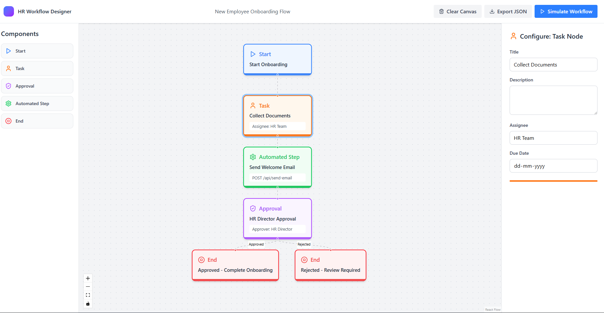
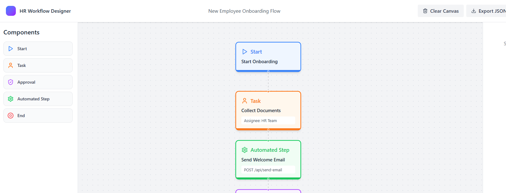
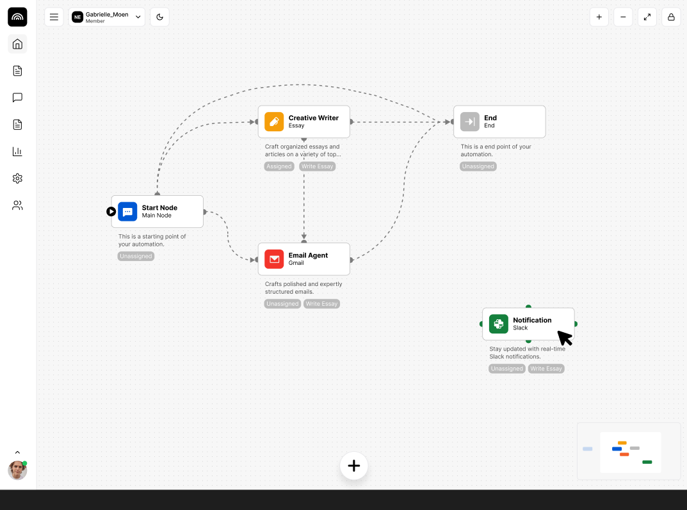
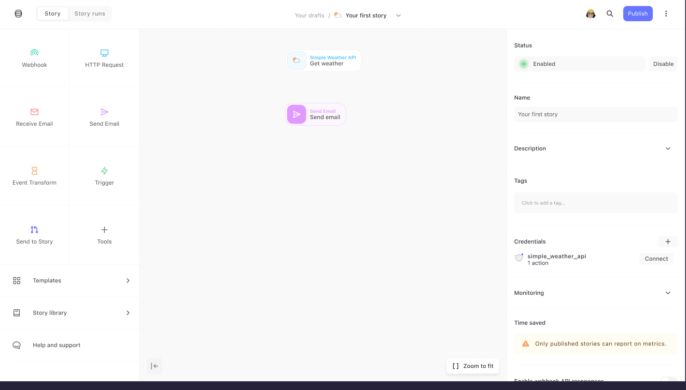
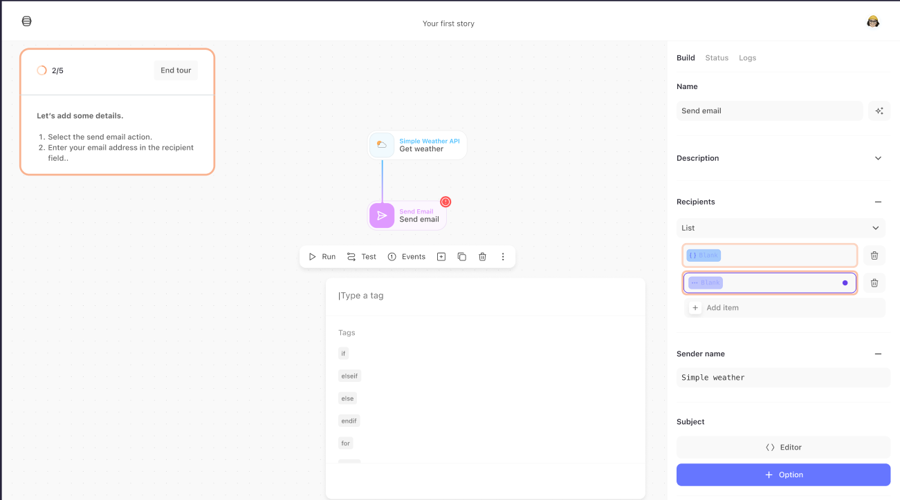

# HR Workflow Designer

A professional-grade workflow design and simulation tool for HR processes, built with React, React Flow, and Tailwind CSS. This application provides an intuitive visual interface for building, configuring, and testing complex workflow automations.



## 🎯 Project Overview

The HR Workflow Designer enables HR teams and process engineers to:
- **Design** complex workflows using a visual drag-and-drop canvas
- **Configure** individual workflow nodes with specific parameters
- **Validate** workflow structure and identify potential issues
- **Simulate** workflow execution with detailed logging
- **Export/Import** workflows as JSON for version control and deployment

## 🏗️ Architecture

### Technology Stack

- **Frontend Framework**: React 18.3.1
- **Build Tool**: Vite 6.3.5
- **Workflow Canvas**: React Flow (@xyflow/react 12.10.2)
- **Styling**: Tailwind CSS v4.1.12
- **UI Components**: Lucide React (icons)
- **Type Safety**: TypeScript
- **State Management**: React Hooks (useState, useCallback)

### Project Structure

```
/workspaces/default/code/
├── src/
│   ├── app/
│   │   ├── App.tsx                      # Main application component
│   │   ├── components/
│   │   │   ├── WorkflowNode.tsx         # Custom node component with 5 types
│   │   │   ├── ComponentPalette.tsx     # Left sidebar with draggable components
│   │   │   ├── ConfigPanel.tsx          # Right sidebar for node configuration
│   │   │   └── SimulationDrawer.tsx     # Bottom drawer for testing/validation
│   │   └── services/
│   │       └── mockApi.ts               # Mock API service layer
│   ├── styles/
│   │   ├── theme.css                    # Tailwind custom tokens
│   │   └── fonts.css                    # Font imports
│   └── imports/                         # Static assets
├── package.json
├── vite.config.ts
└── README.md
```

## 🎨 Design System

### Color Palette

The application uses a professional, data-centric color scheme inspired by modern analytics platforms:

| Node Type | Primary Color | Usage |
|-----------|--------------|-------|
| Start | Blue `rgb(59, 130, 246)` | Entry points |
| Task | Orange `rgb(249, 115, 22)` | Manual activities |
| Approval | Purple `rgb(168, 85, 247)` | Decision points |
| Automated Step | Green `rgb(34, 197, 94)` | API integrations |
| End | Red `rgb(239, 68, 68)` | Termination points |

### Layout Architecture

The application follows a **three-column studio layout**:

1. **Left Sidebar (Component Palette)**: 
   - Width: 256px
   - Contains all node types with icons
   - Click-to-add interaction pattern

2. **Center Canvas (React Flow)**:
   - Flexible width
   - Dot-grid background for visual alignment
   - Pan, zoom, and connection controls

3. **Right Sidebar (Configuration Panel)**:
   - Width: 320px
   - Dynamic forms based on selected node
   - Real-time updates to canvas

4. **Bottom Drawer (Simulation Sandbox)**:
   - Height: 60vh when expanded
   - Three-column layout (JSON / Logs / Validation)
   - Slide-up animation on demand

### Visual Design Principles

- **Minimal Shadows**: Subtle elevation for focus (cards, nodes)
- **High Contrast**: Ensures readability and accessibility
- **Clear Hierarchy**: Typography scale from Tailwind theme
- **Grid System**: Dot-grid background (16px spacing)
- **State Indicators**: Color-coded status (success/warning/error)

## 🔧 Core Features

### 1. Visual Workflow Canvas

Built with React Flow, providing:
- **Interactive node placement** with drag-and-drop
- **Edge connections** between nodes (directional flow)
- **Pan and zoom** controls for large workflows
- **Selection state** with visual feedback
- **Background grid** for alignment

### 2. Node Types (5 Custom Variants)

Each node type has unique:
- **Icon representation** (Lucide React)
- **Color coding** for quick identification
- **Configuration schema** (different form fields)
- **Validation rules** (required fields, constraints)

#### Node Type Details:

**Start Node**
- Icon: Play
- Fields: Title, Description
- Constraint: Workflow entry point

**Task Node**
- Icon: User
- Fields: Title, Description, Assignee, Due Date
- Purpose: Manual human activities

**Approval Node**
- Icon: ShieldCheck
- Fields: Title, Description, Approver Role, Auto-Approval Threshold
- Constraint: Should have 2+ outgoing edges (Approved/Rejected)

**Automated Step Node**
- Icon: Settings
- Fields: Title, Description, API Action (dropdown)
- Integration: Fetches actions from Mock API
- Purpose: System integrations and automations

**End Node**
- Icon: StopCircle
- Fields: Title, Description
- Constraint: Workflow termination point

### 3. Dynamic Configuration Panel

- **Context-aware forms**: Different fields per node type
- **Real-time updates**: Changes immediately reflect on canvas
- **API Integration**: Automated nodes fetch available actions
- **Input validation**: Type-safe form handling
- **Visual feedback**: Color-coded to match selected node

### 4. Mock API Service Layer

Located in `/src/app/services/mockApi.ts`, providing:

```typescript
class MockApiService {
  // Fetch automation actions (for Automated Step nodes)
  static async getAutomations(): Promise<AutomationAction[]>

  // Save workflow to backend
  static async saveWorkflow(workflow: Partial<WorkflowDefinition>)

  // Load workflow from backend
  static async loadWorkflow(id: string)

  // Validate workflow structure
  static async validateWorkflow(nodes, edges): Promise<ValidationResponse>

  // Simulate workflow execution
  static async simulateWorkflow(nodes, edges): Promise<SimulationResponse>

  // Export/Import workflow as JSON
  static exportWorkflow(nodes, edges): string
  static async importWorkflow(jsonString): Promise<{nodes, edges}>
}
```

**Mock Data Includes:**
- 6 predefined automation actions (GET/POST/PUT endpoints)
- Simulated network latency (200-800ms)
- Realistic validation logic (cycle detection, disconnected nodes)
- Execution simulation with timing data

### 5. Workflow Validation Engine

Comprehensive validation checks:

✅ **Structural Validation**
- At least one Start node required
- At least one End node required
- No orphaned nodes (disconnected from flow)

⚠️ **Warning Detection**
- Multiple Start nodes
- Approval nodes without 2 branches
- Nodes missing incoming/outgoing connections

💡 **Suggestions**
- Missing approver assignments
- Unconfigured API actions
- Optimization opportunities

🚫 **Error Detection**
- **Cycle detection** using DFS algorithm
- Prevents infinite loops
- Identifies problematic node chains

### 6. Workflow Simulation

Interactive execution testing:

1. **Pre-flight Validation**: Checks for structural errors
2. **Step-by-step Execution**: Traverses graph from Start to End
3. **Execution Logging**: Real-time updates with timestamps
4. **Performance Metrics**: Duration tracking per node
5. **Visual Feedback**: Animated progress indicators

**Simulation Output:**
```json
{
  "success": true,
  "executionId": "exec-1713604800000",
  "steps": [
    {
      "nodeId": "1",
      "status": "success",
      "timestamp": "2026-04-20T10:00:00Z",
      "duration": 150
    }
  ]
}
```

### 7. Export/Import Functionality

**Export**: Downloads JSON file with:
- Workflow version metadata
- Complete node definitions (data + positions)
- Edge connections with labels
- ISO timestamp for tracking

**Import**: Validates and reconstructs workflows
- JSON schema validation
- Error handling for malformed data
- Preserves visual layout (positions)

## 🧠 Design Decisions & Rationale

### 1. **React Flow over Custom Canvas**

**Decision**: Use React Flow library instead of building custom SVG/Canvas

**Rationale**:
- Production-tested graph visualization
- Built-in features: zoom, pan, minimap, controls
- Accessibility support out-of-the-box
- Performance optimizations for large graphs
- Active maintenance and community support

**Trade-off**: Larger bundle size (~150KB), but acceptable for productivity gains

### 2. **Mock API Service Pattern**

**Decision**: Create abstraction layer for backend communication

**Rationale**:
- **Separation of concerns**: UI logic separate from data fetching
- **Easy testing**: Mock can be swapped with real API client
- **Realistic behavior**: Simulates latency, errors, loading states
- **Type safety**: TypeScript interfaces for API contracts
- **Future-proof**: Real backend integration requires minimal refactoring

**Implementation Notes**:
- All API calls are async (Promises)
- Includes simulated delays (200-800ms)
- Returns realistic response structures

### 3. **Component-Based Architecture**

**Decision**: Break UI into 4 main components + 1 service

**Rationale**:
- **Maintainability**: Each component has single responsibility
- **Reusability**: Components can be used in different contexts
- **Testing**: Easier to unit test isolated components
- **Performance**: React can optimize re-renders per component
- **Developer Experience**: Clear mental model of application structure

### 4. **Three-Column Layout (Studio Pattern)**

**Decision**: Fixed-width sidebars with flexible canvas

**Rationale**:
- **Familiar UX**: Matches professional tools (Figma, Framer, Webflow)
- **Context preservation**: Configuration always visible
- **Efficiency**: No modal dialogs interrupting flow
- **Responsive**: Can collapse sidebars for small screens (future)

### 5. **Bottom Drawer for Simulation**

**Decision**: Slide-up drawer instead of modal or separate page

**Rationale**:
- **Context preservation**: Can view canvas while testing
- **Space efficiency**: 60vh provides ample room without obscuring
- **Multi-column layout**: Shows JSON, logs, validation simultaneously
- **Visual hierarchy**: Drawer clearly indicates "testing mode"

### 6. **Inline Validation vs. Batch Validation**

**Decision**: Validation runs on-demand (button click)

**Rationale**:
- **Performance**: Expensive operations (cycle detection) not on every change
- **User control**: User decides when to validate
- **Clear feedback**: Explicit action → explicit result

**Alternative considered**: Real-time validation
- Rejected due to performance concerns with large graphs
- Could be added as "auto-validate" option in future

### 7. **Type Safety with TypeScript Interfaces**

**Decision**: Define strict types for all data structures

**Rationale**:
- **Compile-time errors**: Catch bugs before runtime
- **IDE autocomplete**: Better developer experience
- **Documentation**: Types serve as inline documentation
- **Refactoring safety**: Rename/restructure with confidence

Key interfaces:
```typescript
WorkflowNodeData      // Node configuration
AutomationAction      // API action definitions
ValidationResponse    // Validation results
SimulationResponse    // Simulation results
```

## 📋 Assumptions & Constraints

### Technical Assumptions

1. **Browser Support**: Modern evergreen browsers (Chrome, Firefox, Safari, Edge)
   - ES6+ features used
   - No IE11 support required

2. **Backend API**: Mock service assumes RESTful JSON API
   - Real backend would follow similar contract
   - Authentication/authorization not implemented

3. **Data Persistence**: No local storage/database
   - Workflows exist in memory only
   - Future: Could add localStorage or IndexedDB

4. **Network**: Assumes reliable connection
   - No offline mode
   - No retry logic for failed requests

### Business Logic Assumptions

1. **Workflow Constraints**:
   - Exactly one active Start node per execution
   - At least one End node required
   - Approval nodes should branch (warning if not)
   - Cycles are invalid (hard error)

2. **Node Execution**:
   - Sequential execution (no parallel paths)
   - Approval nodes follow first outgoing edge (simplified)
   - Automated steps succeed by default (no error simulation)

3. **User Roles**:
   - Single user (no multi-user collaboration)
   - No permission system (all actions allowed)
   - No audit logging

4. **Workflow Complexity**:
   - No limits on node count
   - No limits on edge count
   - Performance tested up to ~50 nodes

### Scope Limitations

**Not Implemented** (but architecturally supported):

- Real backend integration
- User authentication
- Workflow versioning
- Collaborative editing
- Undo/redo functionality
- Copy/paste nodes
- Workflow templates library
- Performance analytics dashboard
- Email/notification integrations
- Custom node types (extensibility)

## 🚀 Getting Started

### Prerequisites

- Node.js 18+ 
- pnpm (recommended) or npm

### Installation

```bash
# Install dependencies
pnpm install

# Start development server
pnpm run dev
```

The application will be available in the preview surface (not localhost in this environment).

### Usage

1. **Add Nodes**: Click components in left sidebar
2. **Connect Nodes**: Drag from node handle to another node
3. **Configure**: Select a node to edit in right sidebar
4. **Validate**: Open simulation drawer → Click "Validate"
5. **Test**: Click "Run Simulation" to execute workflow
6. **Export**: Click "Export JSON" in top bar to download

## 🧪 Testing Strategy

### Manual Testing Checklist

- [ ] Add all 5 node types to canvas
- [ ] Create connections between nodes
- [ ] Configure each node type with different values
- [ ] Validate workflow with intentional errors
- [ ] Validate workflow with warnings
- [ ] Run simulation on valid workflow
- [ ] Export workflow and inspect JSON
- [ ] Clear canvas and verify cleanup

### Edge Cases to Test

1. **Empty Canvas**: Validate with no nodes
2. **Disconnected Graph**: Multiple isolated node chains
3. **Cyclic Graph**: Create intentional cycle
4. **Single Node**: Just Start or just End
5. **Large Workflow**: 20+ nodes performance
6. **Rapid Actions**: Click validate/simulate repeatedly

## 📊 Performance Considerations

### Current Optimizations

- React Flow built-in virtualization for large graphs
- Memoized callbacks with `useCallback`
- Controlled re-renders with `useNodesState`/`useEdgesState`
- Lazy loading of automation actions (only when needed)

### Potential Improvements

- **Code splitting**: Separate simulation drawer into lazy-loaded chunk
- **Web Workers**: Run validation/simulation in background thread
- **Virtual scrolling**: For automation dropdown (if list grows large)
- **Debounced config updates**: Reduce re-renders during typing

## 🔮 Future Enhancements

### Short-term (v2.0)

- [ ] Keyboard shortcuts (Delete, Copy, Paste)
- [ ] Multi-select nodes
- [ ] Workflow templates gallery
- [ ] Dark mode support
- [ ] Undo/Redo functionality
- [ ] Node search/filter

### Mid-term (v3.0)

- [ ] Real backend integration (REST API)
- [ ] User authentication (OAuth)
- [ ] Collaborative editing (WebSockets)
- [ ] Version control (git-style diffs)
- [ ] Custom node types (plugin system)
- [ ] Advanced validation rules (custom logic)

### Long-term (v4.0)

- [ ] AI-powered workflow suggestions
- [ ] Performance analytics dashboard
- [ ] Mobile responsive design
- [ ] Integration marketplace (Slack, Teams, Email)
- [ ] Workflow scheduling and triggers
- [ ] Advanced simulation (error scenarios, load testing)

## 📄 License

This project is a case study demonstration for Tredence recruitment.

## 👤 Author

Built as part of the Tredence Full-Stack Engineer assessment.

---

## 📸 Screenshots

### Main Interface


### Configuration Panel


### Simulation Sandbox


### Validation Results


---

**Technical Questions?** 

For architecture decisions, see the "Design Decisions & Rationale" section above.
For usage instructions, see the "Getting Started" section.
For extending the system, see the "Future Enhancements" section.
